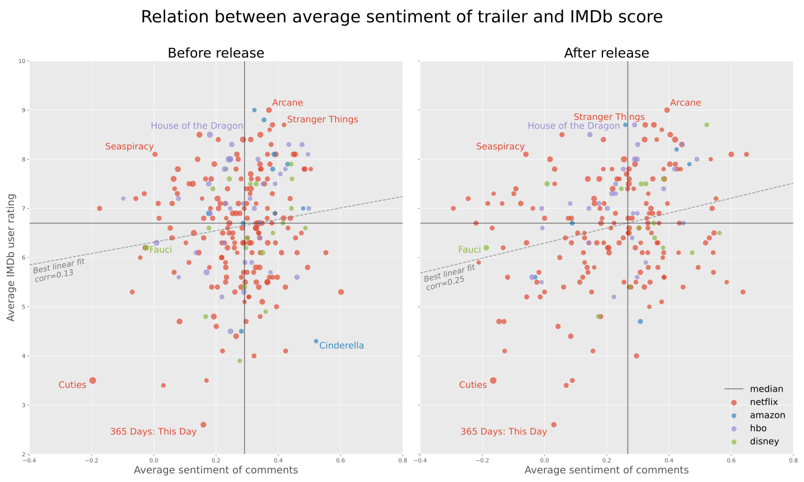

# data-in-the-wild




### Team Members: 
Andreas Belsager (abel@itu.dk), Mads Høgenhaug (mkrh@itu.dk), Marcus Friis (mahf@itu.dk) & Mia Pugholm (mipu@itu.dk)

---

# Get started
This project is split up into 4 main parts:
1. [Data collection](#data-collection)
2. [Data annotation](#data-annotation) (Optional depending on goal)
3. [Data wrangling and processing](#data-wrangling-and-processing)
4. [Data analysis](#data-analysis)

This README documents which files are responsible for what parts, and how to replicate our results. For a full project 
overview, see [Repository Overview](#repository-overview). 

---

# Data collection
To use our data, see the existin data in *[data](data)*.

Data collection can be broken up into 2 separate processes:

1. [Get YouTube data](#get-youtube-data)
2. [Get ReturnYouTubeDislikes data](#get-return-youtube-dislike-data)
 
and   

1. [Download IMDb data](#download-imdb-data)
2. [Scrape IMDb release dates](#scrape-imdb-release-dates)


## Get YouTube data
There are 2 different kinds of data that needs to be scraped from YouTube: trailer video data and comments.
These can both be collected with the [*youtube_api*](src/youtube_api) module. To start off, you first need one or more YouTube 
API key, which should be stored in the [*config.ini*](src/config.ini) file as such:


>[DEFAULT]
> 
>key1=YOUR_API_KEY
> 
>key2=YOUR_API_KEY_2
> 
>keyn=YOUR_API_KEY_n


It is recommended to have multiple keys, since [YouTube's search method](https://developers.google.com/youtube/v3/docs/search/list) quickly use up the api units (see more *[here](https://developers.google.com/youtube/v3/getting-started#quota)*). 
Once *[config.ini](src/config.ini)* has keys, you can collect trailers and comments with *[main.py](src/main.py)* as such

```
cd src/
python main.py
```

This will by default collect all YouTube videos listed with "trailer" from the official channels of Amazon, Disney, 
HBO and Netflix, and output each file in *[data/raw/trailers/](data/raw/trailers)* and *[data/raw/comments/](data/raw/comments)*.


## Get Return YouTube Dislike data
Mads hjælp skriv guidelines og how to do stuff...


## Download IMDb data
IMDb does not have a free API for accessing their data. Instead, IMDb data can be downloaded at https://www.imdb.com/interfaces/. For this project, you will need title.basics.tsv.gz and 
title.ratings.tsv.gz to be located in *[/imdb](data/raw/imdb)*


## Scrape IMDb release dates
Release dates of IMDb entries are not available in any of its official data. However, it is listed on their website. 
As a workaround, we scrape it from their website.

To do this, run *[scrape_release_dates.py](src/data/scrape_release_dates.py)*

```
cd src/data/
python scrape_release_dates.py
```

This will output *[release_dates.csv](data/interim/release_dates.csv)* in *[interim](data/interim)*.

Currently, there are two policies for scraping this date: getting the first US date or getting the most common date. 
This policy can be picked for the former, and the latter in the class with respectively the methods *scrape_dates()* and *scrape_dates_alternate()*

---

# Data annotation
This step can be optionally skipped, but to recreate this exact project, it needs to be done. 
We used the raw scraped comment data, loaded it into a label studio project and annotated sentiments. 
For more information, see the *[paper](reports/paper.pdf)*.

---

# Data wrangling and processing
Once all the data has been collected, it is ready to be wrangled and processed. 

In this step of the pipeline, the following tasks need to be done:
1. [Remove all non-trailers from the trailers data](#cleanup-trailer-data)
2. [Match IMDb data with YouTube trailers](#match-imdb-and-youtube)
3. [Merge all the data](#merge-all-data)

## Cleanup trailer data
This step can be done either using the notebook *[data_cleaning.ipynb](notebooks/reports/data_cleaning.ipynb)* or by 
running the python script *[trailer_cleaning.py](src/data/trailer_cleaning.py)*
```
cd src/data/
python trailer_cleaning.py
```
This creates cleaned trailer files located in *[interim](data/interim)*.

## Match IMDb and YouTube
This process is done manually. There are a number of reasons why we don't currently do it in an automated manner, 
all of which are detailed in the *[report](reports/paper.pdf)*. 

The matching should yield a *match.csv*, which follows
```
tconst,videoId
tt123456,A1b2c3D4E5
...,...
```

## Merge all data
Before this step, the following files should be in their respective repositories

```
data
│
├───external
│   └───imdb
│       ├───title.basics.tsv        
│       └───title.ratings.tsv       
│       
├───interim                   
│   ├───annotated.csv     
│   ├───release_dates.csv 
│   │       
│   ├───match                 
│   │   ├───amazon_match.csv  
│   │   ├───disney_match.csv  
│   │   ├───hbo_match.csv     
│   │   └───netflix_match.csv 
│   │       
│   └───trailers              
│       ├───amazon.csv      
│       ├───disney.csv      
│       ├───hbo.csv     
│       └───netflix.csv
│
└───raw                       
    ├───returnyoutubedislikes.csv
    │
    └───comments               
        ├───amazon_comments.csv
        ├───disney_comments.csv     
        ├───hbo_comments.csv        
        └───netflix_comments.csv        
```
Once this is true, run either *[data_merging.ipynb](notebooks/reports/data_merging.ipynb)* or 
*[data_merging.py](src/data/data_merging.py)* as
```
cd src/data/
python data_merging.py
```
Running the above command should produce the final dataset. 

---

# Data analysis
There are many aspects of the data analysis in this project. All of the code used to produce the results of this study 
can be found in *[notebooks/reports](notebooks/reports)*. Pay attention to:

```
notebooks
└───reports
    ├───EDA.ipynb
    ├───ReturnYouTubeDislikesAnalysis.ipynb
    ├───scatter_relation.ipynb             
    ├───stat_test.ipynb                    
    └───timeseries_analysis.ipynb
```
These exact notebooks are the ones used to produce all the results of this study. 


# Repository Overview
The following describes all files within this project, their purpose and their location.
```
│
├───data                                            <- Directory for all data used in the project
│   ├───external                                    <- Directory for all data from external sources
│   │   └───imdb                                    <- Directory for IMDb data, the contents should be downloaded
│   │       ├───IMDbREADME.md                       <- README detailing how to get the data and which files specifically 
│   │       ├───title.basics.tsv        
│   │       └───title.ratings.tsv       
│   │       
│   ├───interim                                     <- Directory for all files that aren't raw or fully processed
│   │   ├───annotated.csv                           <- All raw data annotations, outputted from Label-Studio
│   │   ├───annotated_aggregate.csv                 <- Aggregate of annotated.csv, aggregates all annotations per comment into one
│   │   ├───match.csv                               <- File for joining IMDb data with YouTube trailer data, composite file of the files found in /match 
│   │   ├───release_dates.csv                       <- Release dates scraped from IMDb with imdbscraper
│   │   ├───trailers.csv                            <- All collected trailers with non-trailers removed
│   │   │       
│   │   ├───match                                   <- Directory for all match.csv files needed for join IMDb and YouTube
│   │   │   ├───amazon_match.csv        
│   │   │   ├───disney_match.csv        
│   │   │   ├───hbo_match.csv       
│   │   │   └───netflix_match.csv       
│   │   │       
│   │   └───trailers                                <- Directory for all processed trailer files for each network, used to create trailers.csv
│   │       ├───amazon.csv      
│   │       ├───disney.csv      
│   │       ├───hbo.csv     
│   │       └───netflix.csv     
│   │       
│   ├───processed                                   <- Directory for final processed dataset
│   │   ├───ProcessedREADME.md                      <- README detailing how to get full dataset
│   │   └───data.csv                                <- File to download from README link
│   │       
│   └───raw                                         <- Directory for all unprocessed data
│       ├───returnyoutubedislikes.csv               <- Data collected with Return YouTube Dislikes API
│       ├───trailers.csv                            <- Trailers collected with youtubevideogetter.py for netflix, disney, amazon and hbo
│       │       
│       ├───comments                                <- Directory for all raw comment data
│       │   ├───amazon_comments.csv     
│       │   ├───disney_comments.csv     
│       │   ├───hbo_comments.csv        
│       │   └───netflix_comments.csv        
│       │       
│       └───trailers                                <- Directory for all composite trailer files, collected with youtubevideogetter.py
│           ├───amazon_trailers.csv      
│           ├───disney_trailers.csv      
│           ├───hbo_trailers.csv     
│           └───netflix_trailers.csv     
│       
├───notebooks                                       <- Directory for all Jupyter Notebooks
│   ├───drafts                                      <- Directory for notebooks used in the process of creating this project
│   │   ├───analysis.ipynb      
│   │   ├───annotation_analysis.ipynb       
│   │   ├───hbo_analysis.ipynb      
│   │   ├───imdb_scraper.ipynb      
│   │   ├───movie_trends.ipynb      
│   │   └───utubetest.ipynb     
│   │       
│   └───reports                                     <- Directory for all finished notebooks, some produce results used in the report
│       ├───data_cleaning.ipynb     
│       ├───data_merging.ipynb                      <- Notebook for putting all composite files together and joining all the data together to form the final data.csv
│       ├───EDA.ipynb                               <- Light exploratory data analysis
│       ├───ReturnYouTubeDislikesAnalysis.ipynb     <- Notebook for exploring Return YouTube Dislike data
│       ├───return_youtube_dislikes.ipynb           <- Notebook for collecting Return YouTube Dislike data
│       ├───scatter_relation.ipynb                  <- Notebook for creating one of the main plots
│       ├───stat_test.ipynb                         <- Notebook for testing the statistical significance of sentiment prerelease
│       └───timeseries_analysis.ipynb               <- Notebook for creatin main timeseries plot
│
├───reports                                         <- Directory for all things used for the paper
│   │   ├───annotation_guide.tex                    <- Annotation guide describing the guidelines for the annotation process
│   │   ├───main.tex                                <- Main LaTeX file for the paper
│   │   ├───paper.pdf                               <- Finalized paper in PDF format
│   │   └───references.bib                          <- References of the paper
│   │
│   └───figs                                        <- Directory for figures of the repo and paper
│       ├───aamatrix.svg                            <- Annotator agreement matrix
│       ├───discourse_time.svg                      <- Sentiment over time for "good" and "bad" trailers
│       ├───likedislike_sentiment_scatter.svg       <- Relationship between like-dislike-ratio and IMDb rating
│       ├───sentiment_rating_scatter.svg            <- Scatterplot of average sentiment and IMDb rating
│       ├───stat_hist.svg                           <- Histogram of ratings for statistical significance test
│       ├───trailer_comment_dist.svg                <- Plots for visualizing the number of comments per trailer
│       └───trailer_dist.svg                        <- Number of collected trailers per network   
│
└───src                                             <- Root directory for all code
    ├───config.ini                                  <- Config file for storing YouTube API keys
    ├───main.py                                     <- Collects YouTube trailers and comments
    ├───sentiment.py                                <- Code for classifying comments using Vader
    ├───visualizor.py                               <- Enforces styleguide used for visualizations
    ├───__init__.py
    │
    ├───data                                        <- Directory for creating all data files
    │   ├───data_merging.py                         <- For creating the final data.csv  
    │   ├───scrape_release_dates.py                 <- Scrapes release dates from tconsts 
    │   └───trailer_cleaning.py                     <- Removes all non-trailers from trailers data
    │
    ├───imdb_api                                    <- Module for scraping IMDb release dates
    │   └───imdbscraper.py                          <- Code for getting release dates from IMDb
    │
    └───youtube_api                                 <- Module for collecting trailers, comments with utilities
        ├───utilities.py                            <- Helper functions for the module
        ├───youtubecommentgetter.py                 <- Gets comments for each video
        ├───youtubegetter.py                        <- Parent class for YoutubeCommentGetter and YoutubeVideoGetter
        └───youtubevideogetter.py                   <- Gets videos from YouTube
```


